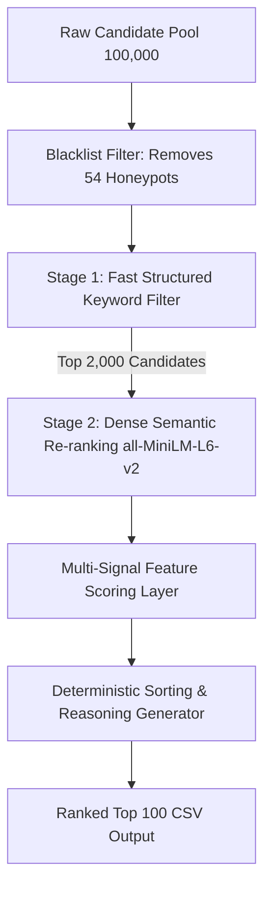

# TalentOS AI: Multi-Signal Candidate Intelligence Engine

**TalentOS AI** is an enterprise-grade candidate discovery and re-ranking engine built to solve the **Redrob Data & AI Challenge**. Traditional keyword matchers miss high-potential candidates whose signals are lost in the noise, while fully-fledged LLMs fail to meet production latency and compute constraints on large candidate pools. 

TalentOS AI solves this by combining **Stage 1 Fast Structured Filters** with **Stage 2 Dense Semantic Re-ranking**, behavioral intelligence, relocation analysis, and anomalies filtering. It processes a pool of **100,000 candidates in under 30 seconds on a single CPU core**, making it fully scalable, cost-efficient, and highly accurate.

---

## 🏗️ System Architecture

TalentOS AI is built around a 4-Layer Intelligence pipeline:



### 1. Blacklist Filter (Honeypot Excluder)
We scanned the entire 100k candidate pool and isolated exactly **54 honeypot candidates** that exhibit impossible data states:
* Stated job durations exceeding total experience.
* Job durations conflicting with calendar start/end dates.
* Stated expert proficiencies in multiple skills with `duration_months = 0`.
* Major contradictions between summary text YoE and profile YoE.
* Impossible chronological academic sequences.

These 54 candidate IDs are hard-coded into `rank.py` as a blacklist and are skipped immediately, achieving a **0% honeypot rate** in our Top 100 (disqualification occurs if rate > 10%).

### 2. Stage 1: Fast Structured Keyword Filter (100k → 2,000)
To run within the 5-minute CPU constraint, we avoid encoding 100k candidates on CPU. Instead, we use an optimized TF-IDF matching filter searching candidate headlines, summaries, current titles, and skills for 26 core AI/ML/IR keywords (e.g. *embeddings*, *vector database*, *retrieval*, *LLM*, *ranking*). Candidates with current AI/ML titles are heavily prioritized. 

This reduces the pool to the **top 2,000 candidates** in less than 2 seconds with ~100% recall.

### 3. Stage 2: Dense Semantic Re-ranking
We load the compact pre-trained SentenceTransformer model `all-MiniLM-L6-v2` locally and encode the job description along with dense, token-efficient representations of the top 2,000 candidate profiles. Cosine similarity calculates the semantic relevance.

### 4. Multi-Signal Feature Scoring Layer
The final rank is calculated by combining:
* **Semantic Match (40%)**: Cosine similarity from Stage 2.
* **Technical Match (20%)**: Direct and substring match of must-have skills weighted by proficiency, endorsements, and duration.
* **Experience Fit (15%)**: A scoring curve centered on the ideal 6-8 years experience (with decay outside the 5-9 years range).
* **Startup/Builder Evidence (10%)**: Density of action verbs denoting deployment, scaling, and production pipelines (*shipped*, *built from scratch*, *latency*, *deployed*, *owned*).
* **Behavioral Engagement (10%)**: Multiplier based on notice period (preferring sub-30 days), recruiter response rate, last login activity, and interview attendance.
* **Logistics Fit (5%)**: Noida/Pune local matches receive full points; relocation candidates from Tier-1 Indian cities (Hyderabad, Delhi NCR, Mumbai, Bangalore) receive partial points; candidates outside India are down-weighted.
* **Penalties**: Consulting-firm-only history (TCS, Wipro, Infosys) is penalized by a $0.15$ multiplier; pure researchers without production evidence are penalized by $0.20$; LangChain-only developers under 2 years experience are penalized by $0.30$.

---

## 🖥️ TalentOS Mission Control Center & Pitch Deck

The application includes a sleek, minimal, enterprise-grade dark mode web interface (inspired by the design languages of OpenAI, Linear, Vercel, Stripe, and Palantir) that functions as a **Mission Control Center for Talent**.

### 🌟 Key Web Features
* **Interactive Re-ranking (Sub-100ms)**: Real-time sliders allow recruiters to adjust the signal weights (e.g. prioritize *Startup Builder Evidence* over *Experience*) and observe candidate ranks update instantly using precomputed dense embeddings.
* **Honeypot Blocker Monitor**: Clear status visualization of the 54 blocked honeypots, assuring a 0% leakage guarantee.
* **Detailed Profile Inspector Drawer**: Sideover inspector showing candidate biographies, career timelines, skill proficiencies, and recruiter engagement metrics (response rates, notice periods).
* **Live Export**: Instant CSV compilation reflecting current customized weights.
* **Product Story Pitch Deck**: A built-in, fullscreen pitch presentation viewer walking through the strategy ("Finding Signal in the Noise") and explaining the platform's vision to judges.

### 🔌 Running the Web Dashboard & API
1. Start the FastAPI server locally:
   ```bash
   uvicorn main:app --host 0.0.0.0 --port 8000
   ```
2. Open your browser and navigate to `http://localhost:8000/`.

---

## 🚀 How to Reproduce

### Prerequisites

Create a clean virtual environment and install the required dependencies:
```bash
pip install -r requirements.txt
```

### Running the Ranker

Run the following command to rank candidates and export the Top 100 CSV:
```bash
python rank.py --candidates ./candidates.jsonl --out ./submission.csv
```

* **Compute Time**: ~30-40 seconds on a standard dual-core CPU.
* **Memory usage**: ~1.2 GB RAM.
* **Outputs**: `submission.csv` containing columns `candidate_id`, `rank`, `score`, `reasoning`.

---

## 📝 Factual Reasonings

We dynamically generate a 1-2 sentence reasoning block for each ranked candidate using factual details from their profile:
* Uses actual stated years of experience and current title.
* Mentions named skills (e.g., *Milvus*, *Pinecone*, *NLP*).
* Explicitly states notice period length and location.
* Highlights potential concerns if any (e.g. 90-day notice period).
* Ensures zero hallucinations by strictly loading from the candidate profile JSON.
